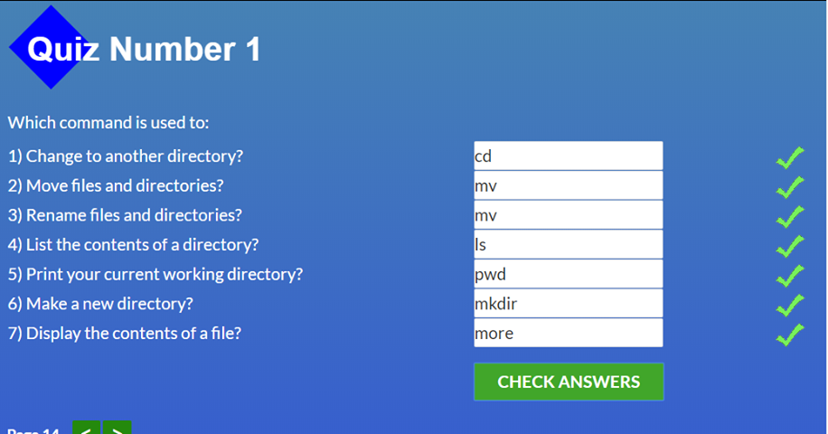
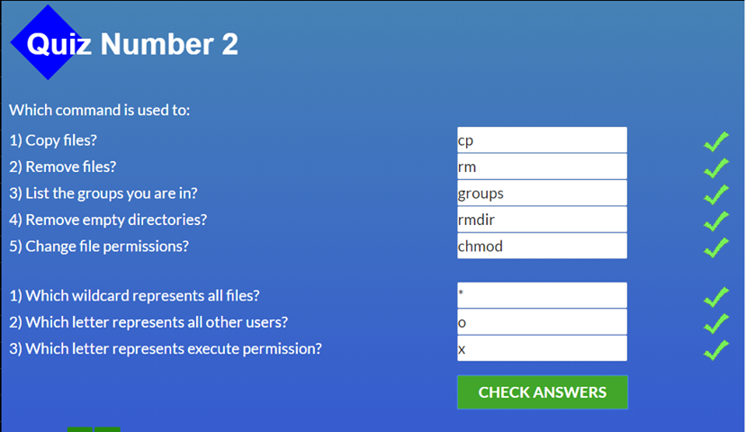
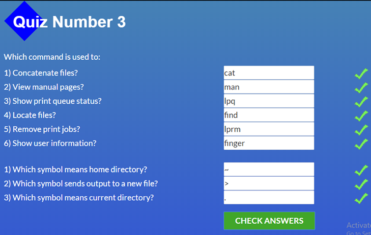
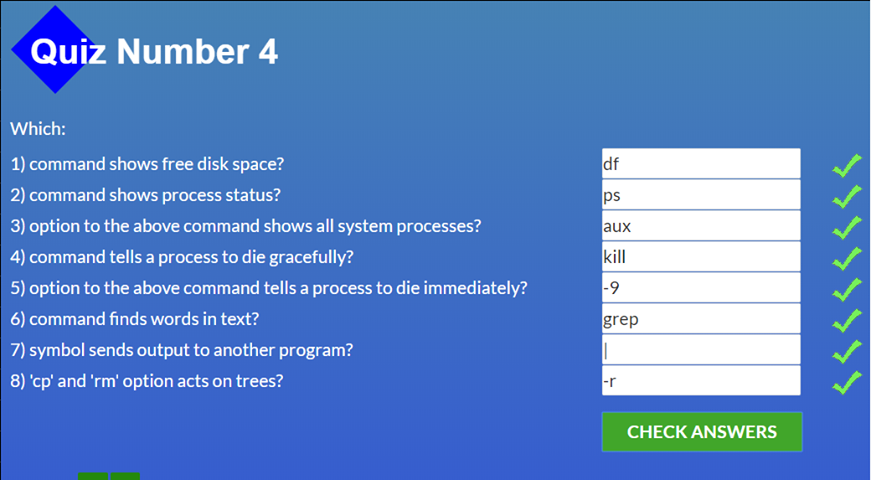
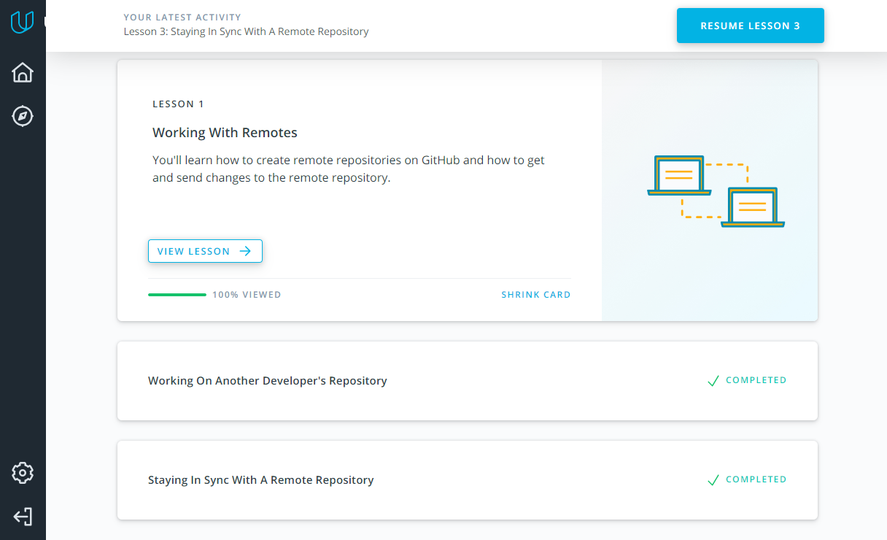

## Git Basics

Git is cool!

## Unix Shell

Shell is also cool! I will use it a lot in the future when I become web developer.

## Git Collaboration

I like **_rebase_** command the most! It is the best!
